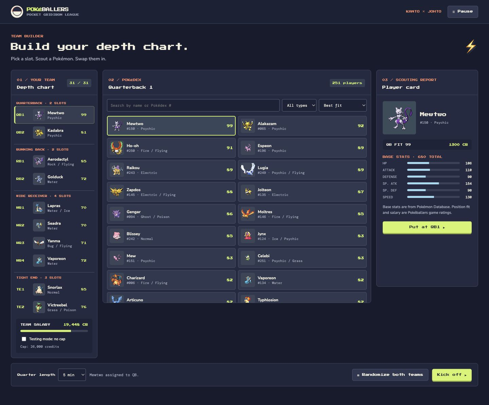
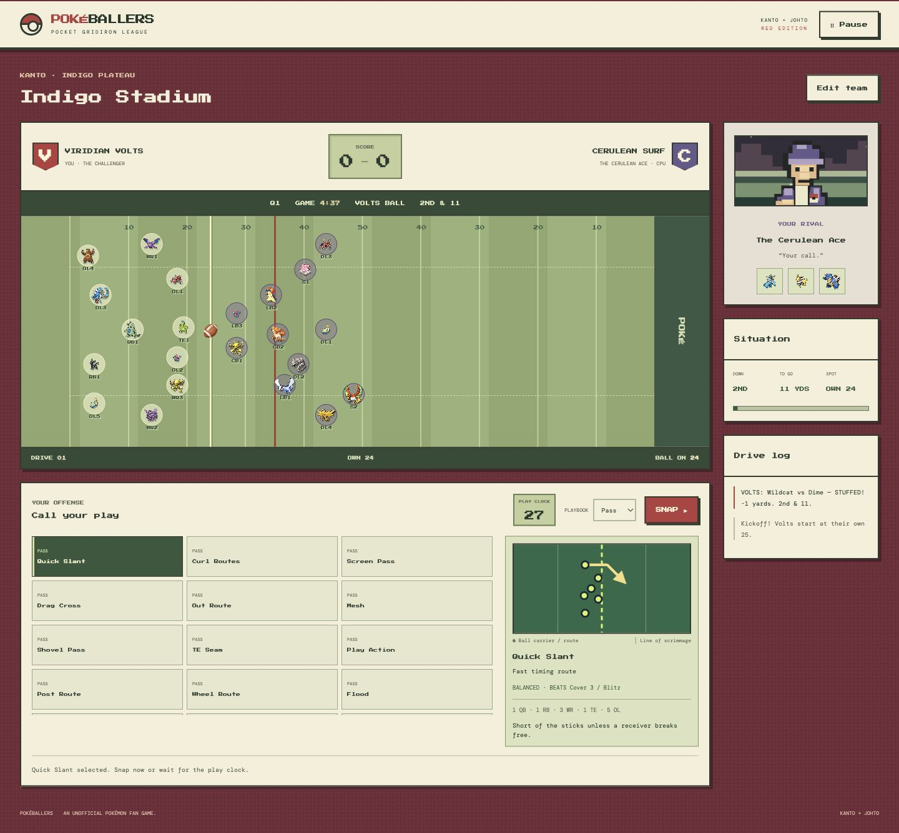
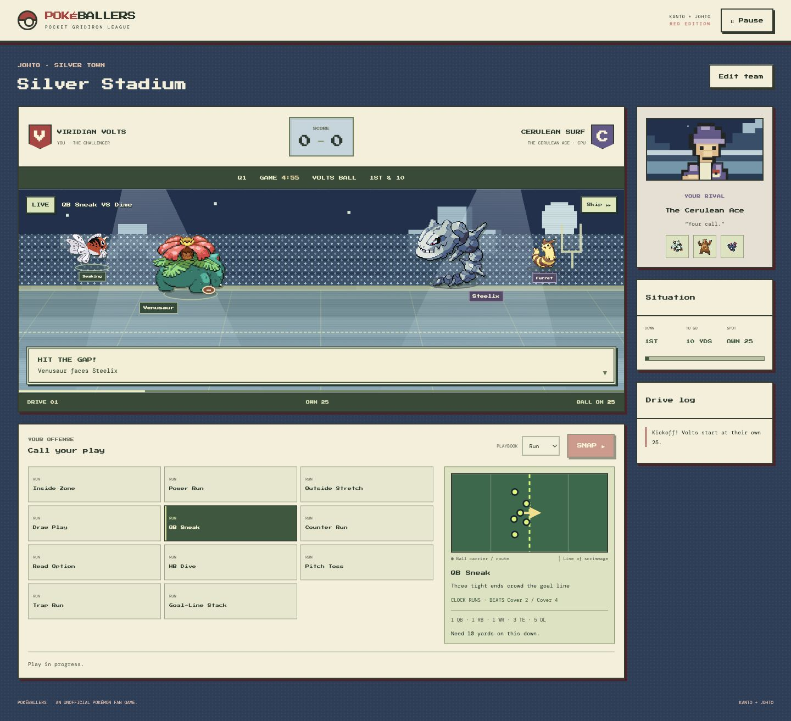
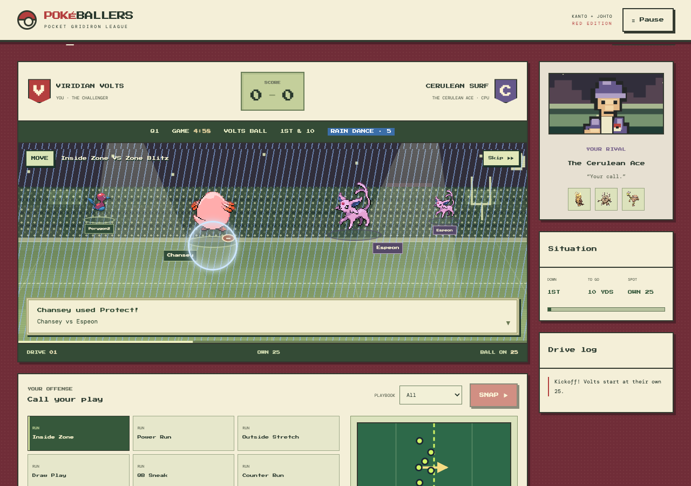

# Pokéballers

A Pokémon football fan game with Red-inspired menus, a Game Boy palette, and stadium themes from Kanto and Johto.

Open `index.html` in a browser to play. No server or install is required. Internet access adds Pokémon sprites; the game falls back to local symbols when sprites are unavailable.

## Screenshots

Team builder with separate credit caps and stadium selection.



Indigo Stadium playbook and route diagram.



A live play in Silver Stadium.



A move in the rain: Chansey uses Protect while Rain Dance is active.



[PNG screenshots and artwork for sharing](docs/screenshots/png/).

## Playing

### Build your team

1. Choose a stadium and a quarter length (3, 5, 8, or 12 minutes).
2. Set each team's credit cap (9,500–27,000 credits in 500-credit steps; default 26,000). Changing a cap keeps the current picks. Both teams must be within budget to kick off; **free play** removes both caps.
3. Generate one team or shuffle both, then adjust by hand: click a roster slot, choose a Pokémon, and assign it from the player profile. On phones, swipe through the roster slots.
4. Pick each player's four moves in the profile (see [Moves](#moves)). Every player starts with a default set, so this step is optional.

A team has 31 Pokémon across nine positions; each play fields 11. Position fit comes from base stats: speed and attack make receivers and backs, defense and HP make linemen, special attack makes quarterbacks. Salary follows base stat total, and legendaries cost extra. Generated teams contain no duplicates.

### Call a play

You call offense on your possessions and defense on the rival's. The offense playbook has 40 calls in five groups (run, pass, trick, clock, special); the defense has 26 coverages and fronts. Select a call to see its routes, coverage, and personnel package, then press **Snap** (or **Lock in** on defense).

- **Play clock.** Both sides get 40 seconds, or 25 at kickoff and after a possession or quarter change, following the [NFL play-clock rule](https://static.www.nfl.com/image/upload/fl_attachment/league/tqivdkzt9mu6wdgsh1ku.pdf#page=20). At zero, your selected call runs; with no selection, a random legal run, pass, or trick call runs.
- **Scout and audible.** The rival commits before you do. Scouting shows a partial formation tell, and you get one audible after it.
- **Offense choices.** Pick a lane (left, middle, right) for runs, an active receiver for passes, keep or hand off on Read Option, and run or pass on the RPO.
- **Tempo.** A running clock burns time before the snap: normal 15 seconds, hurry-up 3, chew-clock 30. A sideline finish stops the clock at a small yardage cost.
- **Clock calls.** Spike costs one second and a down; Kneel costs one yard and keeps the clock running.
- **Fourth down.** Go for it, punt, or kick. Field goal odds fall with distance and rise with the quarterback's rating.

### How a play resolves

Every scrimmage play becomes three contests between the players on the field:

- **Protection**: an offensive lineman against the rusher across the line. It sets sack and stuff odds.
- **Separation**: the receiver or carrier against the cover man. It sets completion and interception odds.
- **Tackle**: the carrier against the tackler. It sets yards after contact and fumble odds.

Ratings, stamina, the scheme matchup between the two calls, abilities, and moves all feed these margins. The battle scene then shows the featured players: the carrier, a supporting player, the defender who made the play, and the safety help. The animation never decides a result.

### Stamina, substitutions, and timeouts

Every snap tires the active unit, and the featured players tire most. Below 70 stamina a player's ratings drop. Bench players recover each snap, every quarter break restores some stamina, and halftime restores it fully. Use the depth chart to swap players or turn on **automatic rotation** to replace tired starters. Each team has three timeouts per half; a timeout stops the clock and gives both teams a short rest.

### Abilities

Three types unlock a team ability: **Electric Burst** (an Electric carrier or front defender gains escape or rush), **Steel Shield** (a Steel blocker or front defender gains protection or tackling), and **Psychic Read** (a Psychic quarterback or coverage player reveals the rival's real call). Each team gets two charges per half and fires at most one ability per call. Charges and the ten-stamina cost are paid at the snap.

### Moves

Every Pokémon carries up to four moves from its Gen 2 (Crystal) learnset. Before the snap, fire one move from an eligible player: on offense the carrier, the passer on a pass, or any lineman or tight end; on defense anyone in the unit. Moves sit beside abilities, so one call can use both. The rival's move appears at the snap.

- **PP.** Each move has `ceil(PP ÷ 5)` uses per game for that player: Tackle 7, Thunderbolt 3, Hydro Pump 1.
- **Cost.** A move costs stamina (6, plus more for powerful strikes) and needs at least 20 stamina to fire.
- **The user takes the contest.** Firing a move puts its user into the play: a defensive lineman becomes the rusher, a linebacker or defensive back becomes the cover man or tackler, and a lineman becomes the featured blocker.
- **Accuracy.** A move can miss; a miss still costs its PP and stamina.

| Kind | Examples | Effect |
| --- | --- | --- |
| Strike | Thunderbolt, Earthquake, Quick Attack | Adds to the user's contest margin, scaled by power, same-type bonus (×1.5), type effectiveness against the opponent (0 to ×4), and the user's attack or special attack. Priority moves add 8; high-crit moves can double. Capped at 30. |
| Status | Thunder Wave, Sleep Powder, Toxic, Confuse Ray | Puts a condition on the opponent for a few of its team's snaps (below). Strikes with a secondary effect roll it automatically at twice the game chance. |
| Stat change | Agility, Swords Dance, Growl, Sand-Attack | Raises the user's stat or lowers the opponent's for three snaps, up to two stages. |
| Heal | Recover, Soft-Boiled, Milk Drink | Restores 50 stamina to the user. |
| Field | Reflect, Light Screen, Safeguard, Mist, Haze, Rain Dance, Sunny Day, Sandstorm, Spikes | Changes the field for five snaps (Spikes: the rest of the half). |
| Protect | Protect, Detect | Offense: a sack, stuff, fumble, or interception becomes no gain. Defense: the play gains at most 5 yards. |
| One-hit | Fissure, Horn Drill, Guillotine | 30% accuracy. A hit is a breakaway touchdown on offense or a turnover on defense. |
| Roar | Roar, Whirlwind | Sends the opponent to the bench for two snaps. |

| Condition | Badge | Effect | Snaps |
| --- | --- | --- | --- |
| Paralysis | PAR | Speed −25% | 4 |
| Sleep | SLP | Ratings −40 | 2 |
| Freeze | FRZ | Ratings −40 | 2 |
| Burn | BRN | Attack −25% and 3 stamina per snap | 4 |
| Poison | PSN | 5 stamina per snap (Toxic 8) | 5 |
| Confusion | CNF | One-in-three chance per snap to lose 15 margin | 3 |
| Trap | | Cannot leave the field | 3 |
| Leech Seed | | Loses 4 stamina per snap to the user | 5 |

Conditions count down on every snap the player's team plays, on the field or on the bench, so a substitution protects the team but does not cure the player. A player holds one of paralysis, sleep, freeze, burn, or poison at a time. Rain powers up Water strikes and weakens Fire (Sun does the reverse); Sandstorm drains every player who is not Rock, Ground, or Steel; Safeguard blocks new conditions and Mist blocks stat drops. Badges show on the depth chart, the lineup, and the battle sprites, and the scoreboard shows the active weather.

Ditto and Smeargle have no usable moves, and a few Pokémon (Magikarp, Caterpie, Unown, and others) have fewer than four.

### The CPU rival

The CPU calls plays from down, distance, field position, score, clock, roster ratings, and your recent tendencies. It kicks and punts on fourth down by field position, calls timeouts late in the half when behind, rotates tired players automatically, fires an ability on about a third of calls, and fires its best available move on 40% of calls.

### Game flow

The game plays four quarters. Halftime resets timeouts, ability charges, and Spikes, restores stamina, and gives the rival the second-half kickoff. A tie after four quarters goes to overtime, where the next score wins. **Pause** freezes the play clock and playback; **Skip** finishes the current animation. With the system's reduced-motion setting, plays use fixed poses, shorter playback, and captions without projectiles, weather layers, or particles.

The stadium themes are based on [Indigo Stadium in Kanto](https://bulbapedia.bulbagarden.net/wiki/Indigo_Plateau_Conference) and [Silver Stadium in Johto](https://bulbapedia.bulbagarden.net/wiki/Silver_Conference) from the animated series. Each has its own scenery, field colors, and lighting. The stadium does not change football rules. The [NFL fourth-down decision guide](https://www.nfl.com/news/introducing-the-next-gen-stats-decision-guide-a-new-analytics-tool-for-fourth-do) and [third-down defense overview](https://www.nfl.com/news/breaking-down-the-money-down-for-nfl-defenses-09000d5d810e76f3) informed the simplified rules.

## Development

Refresh the Pokémon Database stats and the PokeAPI Crystal moves and type chart with `python3 scrape_pokedex.py`. Commit both `pokemon_gen1_2.json` and `pokemon_gen1_2.js`. Salaries, position ratings, and football outcomes are game rules.

Use Node.js 24 or newer for the development tools:

```sh
npm ci
npm run lint
npm run format:check
npm test
node scripts/balance.cjs 500  # points per game with moves off and on
# Gameplay and UI regressions alone:
npm run test:mechanics
python3 -m unittest discover -s tests -p 'test_pokedex.py'
```

No build step is needed. For a local preview, run `python3 -m http.server 8000 --bind 127.0.0.1` and visit `http://127.0.0.1:8000`.

Football rules and roster logic live in `src/game/`; drafting, diagrams, sprites, and animation live in `src/ui/`. See the [architecture walkthrough](docs/ARCHITECTURE.md) for ownership and the browser checklist, and [CONTRIBUTING.md](CONTRIBUTING.md) for checks and contribution guidance.

## Credits and inspiration

Special thanks to **Anshu Chimala** and [**Pocket Aces**](https://github.com/achimala/pocket-aces) for the animation inspiration, especially [PipSprite](https://github.com/achimala/pocket-aces/blob/main/src/ui/components/PipSprite.tsx) and [BattleScene](https://github.com/achimala/pocket-aces/blob/main/src/ui/components/BattleScene.tsx). Pokéballers uses its own code and artwork.

Pokémon sprites are loaded from the [PokeAPI sprites repository](https://github.com/PokeAPI/sprites). Base stats come from [Pokémon Database](https://pokemondb.net/pokedex/all). Moves, Crystal learnsets, and the Gen 2 type chart come from [PokeAPI](https://pokeapi.co/). The trainer and stadium SVGs in `assets/` are original artwork. Fonts: DM Mono and Press Start 2P from [Google Fonts](https://fonts.google.com/), with local fallbacks.

## License

Original project code is available under the [MIT license](LICENSE). This is an unofficial Pokémon fan project, unaffiliated with Nintendo, Game Freak, or The Pokémon Company. Pokémon names, characters, and sprites, including those shown in the screenshots, remain the property of their respective rights holders and are not licensed by this repository's MIT license. See the sprite source's [licensing notice](https://github.com/PokeAPI/sprites/blob/master/LICENCE.txt). Third-party data and fonts retain their own terms.
